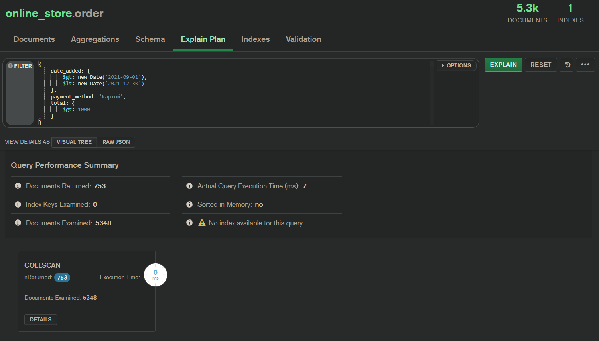
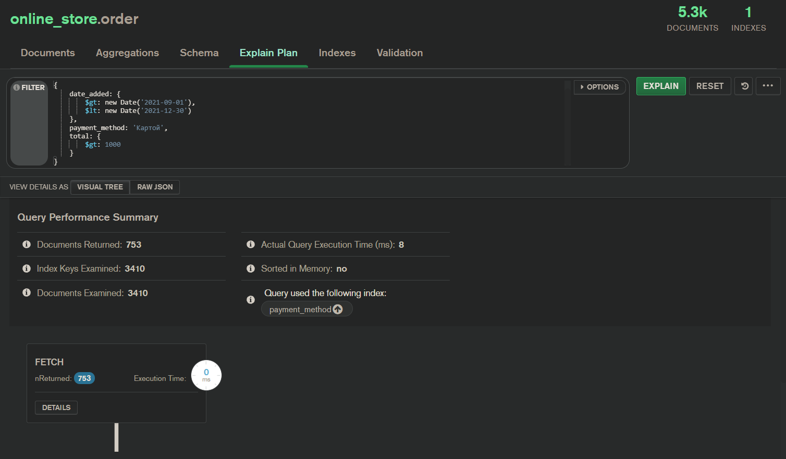

# Домашняя работа № 20. MongoDB

## 1. Установка Mongo.
Устанавливаем Mongo через docker.

    docker pull mongo

Также устанавливаем Compass, и запускаем контейнер с mongo.

## 2. Наполнение БД.
Наполним БД данными из нашего проекта online_store.  
Скрипты лежат в корне в файле dump.js  
Эти команды выполняем в консоли Compass

## 3. Операции с данными

### Имитация JOIN. Получаем товары + текстовые описания к ним.

    db.product.aggregate([
        {
            $lookup:
            {
                from: "product_description",
                localField: "_id",
                foreignField: "product_id",
                as: "description"
            }
        }
    ]);

### Трансформация строк.
Специально в таблице товаров даты были импортированы как строки, для демонстрации.  
Этим запросом можно конвертировать строки в нужный тип.

    db.product.aggregate([
        {
            "$addFields": {
                "date_available": {
                    "$toDate": "$date_available"
                }
            }
        }
    ]);

## 4. Индексы
Проверяем скорость работы отчета по продажам с оплатой по карте за 4й квартал 2021 года, с суммой больше 1000.

    db.order.find({ 
        date_added: { 
            $gt: new Date('2021-09-01'), 
            $lt: new Date('2021-12-30') 
        }, 
        payment_method: 'Картой', 
        total: { 
            $gt: 1000 
        } 
    });

### Скорость работы до

### Добавляем индекс
    db.order.createIndex({ "payment_method": 1 }, { background: true })

### Скорость работы после

  

Скорость работы не изменилась. Мало данных для полноценной оценки. При таком количестве отбор и так работает на очень высокой скорости. 
