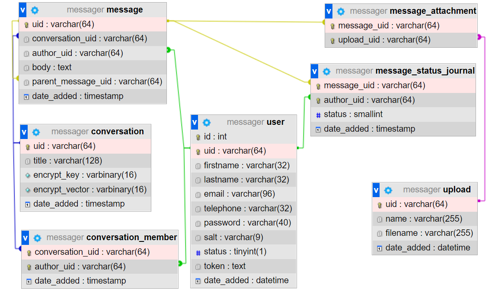
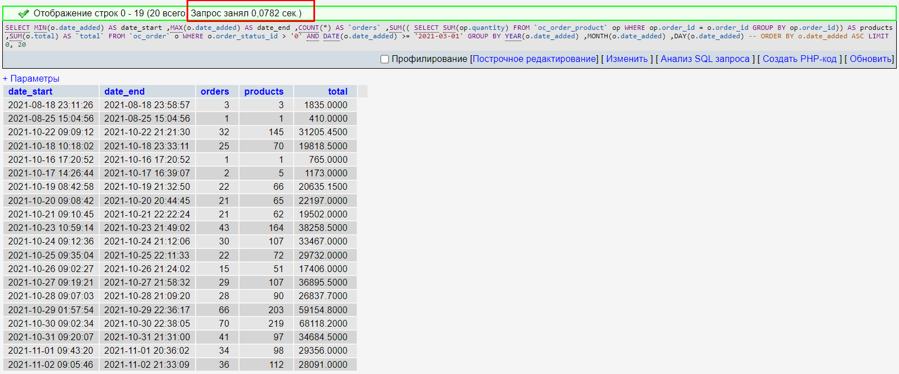
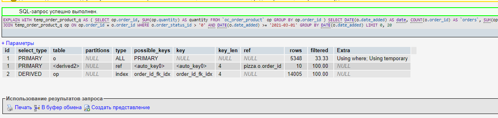
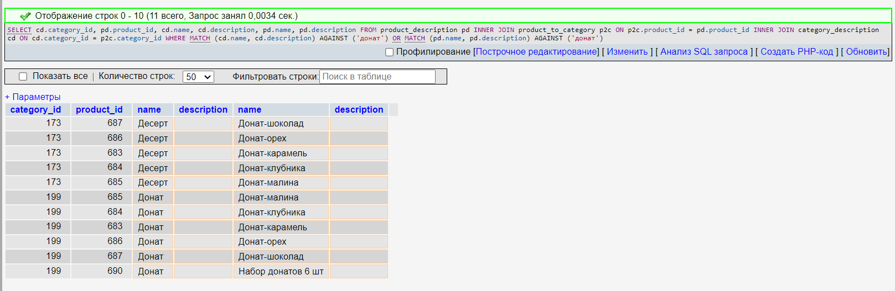
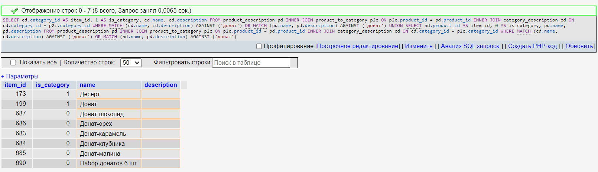

# Домашнее задание № 14. Индексы.
## 1. Анализ текущих индексов на проекте.
Переработка текущих индексов не нужна. При выполнении ДЗ 2 был предусмотрен оптимальный набор индексов.
Есть пример из реальной практики с этой схемой БД, как один индекс ускорил выборку данных на несколько порядков.
Существует старый отчет, выполняющий выборку данных по кол-ву заказов, кол-ву проданных товаров и выручке с разбивкой по дням.
Он был написан изначально не оптимально, и стояла задача сделать что то оперативно, чтобы он заработал быстрее.

### Запрос

    SELECT  
        MIN(o.date_added) AS date_start,
        MAX(o.date_added) AS date_end,
        COUNT(o.id)          AS `orders`,
        SUM((
            SELECT  SUM(op.quantity)
            FROM `order_product` op
            WHERE op.order_id = o.order_id
            GROUP BY  op.order_id)) AS products,
        SUM(o.total)  AS `total`
    FROM `order` o
    WHERE o.order_status_id > 0
        AND DATE(o.date_added) >= '2021-03-01'
    GROUP BY  
        YEAR(o.date_added),
        MONTH(o.date_added),
        DAY(o.date_added)
    LIMIT 0, 20

### Был добавлен индекс в таблицу order_product, на поле со ссылкой на таблицу с заказами

    ALTER TABLE `order_product` ADD INDEX `order_id_fk_idx` (`order_id`);

### Результаты добавления индекса

#### ДО

#### ПОСЛЕ

### Итог: индексы на внешние поля иногда помогают. Но этот запрос потом переработали на CTE.

    WITH temp_order_product_q AS (
        SELECT op.order_id, SUM(op.quantity) AS quantity
        FROM `order_product` op
        GROUP BY  op.order_id
    )
    SELECT DATE(o.date_added) AS date,
        COUNT(o.id)          AS `orders`,
        SUM(op.quantity) AS products,
        SUM(o.total)  AS `total`
    FROM `order` o
    INNER JOIN temp_order_product_q op
        ON op.order_id = o.id
    WHERE o.order_status_id > '0'
        AND DATE(o.date_added) >= '2021-03-01'
    GROUP BY 
        DATE(o.date_added)
    LIMIT 0, 20

#### ПОСЛЕ CTE

## 2. Работа с полнетекстовым поиском
### Для начала импортируем дамп БД sql_dump.sql

### Создаем полнотекстовые индексы на таблицы с описанием
    ALTER TABLE `product_description` ADD FULLTEXT (`name`, `description`);
    ALTER TABLE `category_description` ADD FULLTEXT (`name`, `description`);

### Делаем выборку товаров и категорий, которые могут быть с донатами
    SELECT 
        cd.category_id, 
        pd.product_id, 
        cd.name, 
        cd.description, 
        pd.name, 
        pd.description 
    FROM product_description pd
    INNER JOIN product_to_category p2c
        ON p2c.product_id = pd.product_id
    INNER JOIN category_description cd
        ON cd.category_id = p2c.category_id
    WHERE MATCH (cd.name, cd.description) AGAINST ('донат')
        OR MATCH (pd.name, pd.description) AGAINST ('донат');

### Результат выборки

Как видим, поиск работает. 
Далее, в зависимости от потребностей бэкенда, мы можем отдать либо ID товаров, либо ID категорий. 
Либо отдать сводную таблицу для результов поиска:

    SELECT 
        cd.category_id AS item_id, 
        1 AS is_category,
        cd.name, 
        cd.description
    FROM product_description pd
    INNER JOIN product_to_category p2c
        ON p2c.product_id = pd.product_id
    INNER JOIN category_description cd
        ON cd.category_id = p2c.category_id
    WHERE MATCH (cd.name, cd.description) AGAINST ('донат')
        OR MATCH (pd.name, pd.description) AGAINST ('донат')
    UNION 
    SELECT 
        pd.product_id AS item_id, 
        0 AS is_category,
        pd.name, 
        pd.description 
    FROM product_description pd
    INNER JOIN product_to_category p2c
        ON p2c.product_id = pd.product_id
    INNER JOIN category_description cd
        ON cd.category_id = p2c.category_id
    WHERE MATCH (cd.name, cd.description) AGAINST ('донат')
        OR MATCH (pd.name, pd.description) AGAINST ('донат')

### Результат выборки
