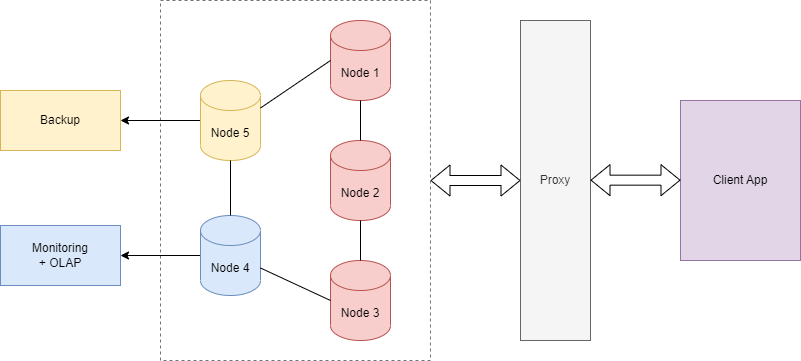
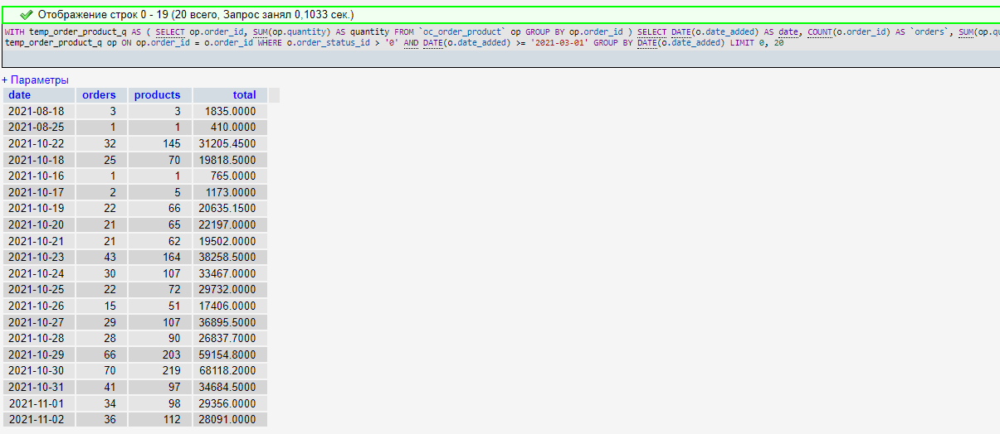

# Домашняя работа № 18. Оптимизация производительности. Профилирование. Мониторинг 

### Дисклеймер.
Скорее всего, я поступлю некрасиво, но я использую часть ДЗ №14. 
В ней я описал кейс, когда знания, которые были получены в ходе курса, помогли в оптимизации тяжеловесного запроса, еще не зная, что будет такая ДЗ.
Ниже будут описаны шаги, как было найдено узкое место:
## 1. Анализ запроса
Существует старый отчет, выполняющий выборку данных по кол-ву заказов, кол-ву проданных товаров и выручке с разбивкой по дням.
### Запрос

    SELECT  
        MIN(o.date_added) AS date_start,
        MAX(o.date_added) AS date_end,
        COUNT(o.id)          AS `orders`,
        SUM((
            SELECT  SUM(op.quantity)
            FROM `order_product` op
            WHERE op.order_id = o.order_id
            GROUP BY  op.order_id)) AS products,
        SUM(o.total)  AS `total`
    FROM `order` o
    WHERE o.order_status_id > 0
        AND DATE(o.date_added) >= '2021-03-01'
    GROUP BY  
        YEAR(o.date_added),
        MONTH(o.date_added),
        DAY(o.date_added)
    LIMIT 0, 20;

### Выполняем EXPLAIN запроса

    EXPLAIN SELECT  
        MIN(o.date_added) AS date_start,
        MAX(o.date_added) AS date_end,
        COUNT(o.id)          AS `orders`,
        SUM((
            SELECT  SUM(op.quantity)
            FROM `order_product` op
            WHERE op.order_id = o.order_id
            GROUP BY  op.order_id)) AS products,
        SUM(o.total)  AS `total`
    FROM `order` o
    WHERE o.order_status_id > 0
        AND DATE(o.date_added) >= '2021-03-01'
    GROUP BY  
        YEAR(o.date_added),
        MONTH(o.date_added),
        DAY(o.date_added)
    LIMIT 0, 20;

### Результат EXPLAIN
Как видим, в запросе не используется индексы, и сам запрос написан не оптимально, используется подзапрос. Из-за этого запрос выполняется 250 сек.

## 2. Оптимизация запроса
Оптимизация будет заключаться в добавлении индекса на таблицу order_product, а также в переработке запроса, используя CTE.

### Индекс в таблицу order_product, на поле со ссылкой на таблицу с заказами

    ALTER TABLE `order_product` ADD INDEX `order_id_fk_idx` (`order_id`);

### Использование CTE.

    WITH temp_order_product_q AS (
        SELECT op.order_id, SUM(op.quantity) AS quantity
        FROM `order_product` op
        GROUP BY  op.order_id
    )
    SELECT DATE(o.date_added) AS date,
        COUNT(o.id)          AS `orders`,
        SUM(op.quantity) AS products,
        SUM(o.total)  AS `total`
    FROM `order` o
    INNER JOIN temp_order_product_q op
        ON op.order_id = o.id
    WHERE o.order_status_id > '0'
        AND DATE(o.date_added) >= '2021-03-01'
    GROUP BY 
        DATE(o.date_added)
    LIMIT 0, 20

### Результат EXPLAIN
Как видим, в запросе теперь используется индекс а также был убран тяжелый подзапрос. Из-за этого запрос выполняется меньше 200мс.

